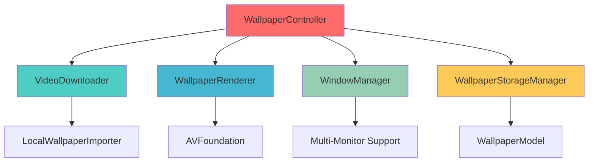

# 🌟 Walle

<div align="center">
  
**Transform your macOS desktop with stunning animated wallpapers**

*A modern, minimal application for high-quality video wallpapers with seamless desktop integration*

[]()
[]()
[]()

</div>

---

## ✨ What is Walle?

Walle brings your desktop to life with beautiful animated video wallpapers. Whether you want calming nature scenes, abstract animations, or custom content, Walle handles it all with optimized performance and native macOS integration—completely free.

<div align="center">

### 🎬 Supported Formats
`.mp4` • `.mov` • `.webm`

</div>

---

## 🚀 Key Features

<table>
<tr>
<td width="50%">

### 🔄 **Seamless Looping**
Apply any video file as your desktop background with perfect loop transitions

### 🌐 **Dual Source Support**
Import your own videos or browse curated online collections

### 🖥️ **Multi-Monitor Ready**
Automatically detects and optimizes for all connected displays

</td>
<td width="50%">

### 📥 **Smart Downloads**
Built-in download manager with pause, resume, and progress tracking

### ⚡ **Performance Optimized**
Low CPU/GPU usage with memory-efficient playback engine

### 👀 **Live Previews**
Preview videos with resolution and duration info before applying

</td>
</tr>
</table>

---

## 🛠️ Technical Excellence

<div align="center">

| **Architecture** | **Storage** | **Performance** | **Integration** |
|:---:|:---:|:---:|:---:|
| 🧩 Modular Backend | 💾 Persistent Data | 🧠 Memory Efficient | 🍎 Native macOS |
| AppKit + SwiftData | Auto-restore Settings | Optimized Playback | Background Launch |

</div>

---

## 📦 Quick Start

### Installation

```bash
# Clone the repository
git clone https://github.com/zahintapadar/Walle.git

# Navigate to project
cd Walle

# Open in Xcode
open Walle.xcodeproj
```

### Build & Run
1. Select your target device in Xcode
2. Press `Cmd + R` to build and run
3. Grant necessary permissions when prompted
4. Start adding your favorite video wallpapers!

---

## 🏗️ Architecture Overview

<div align="center">



</div>

### Core Components

| Component | Responsibility |
|-----------|---------------|
| `WallpaperModel.swift` | 📄 SwiftData model for wallpaper metadata |
| `VideoDownloader.swift` | 📥 Async downloads with pause/resume functionality |
| `WallpaperRenderer.swift` | 🎥 AVPlayer-based video rendering engine |
| `WallpaperStorageManager.swift` | 💾 Local file and thumbnail management |
| `WindowManager.swift` | 🖼️ Background-level window handling across screens |
| `WallpaperController.swift` | 🎛️ Main coordinator orchestrating all services |
| `LocalWallpaperImporter.swift` | 📁 User video import and validation |
| `AppConfiguration.swift` | ⚙️ Preferences and user settings management |

---

## 🗺️ Roadmap

<div align="center">

### Coming Soon

</div>

- [ ] 🌐 **Online Wallpaper Browser** — Integration with motionbgs.com and similar services
- [ ] 🎯 **Drag & Drop Import** — Effortless wallpaper addition to main window
- [ ] 🔍 **Search & Tagging** — Organize your wallpaper collection intelligently  
- [ ] 🔋 **Battery Saver Mode** — Automatic optimization for laptop users
- [ ] 🌙 **Screensaver Integration** — Optional screensaver mode support

---

## 📄 License

<div align="center">

**MIT License**

*Feel free to use, modify, and distribute this project*

</div>

---

## 🙏 Credits & Acknowledgments

<div align="center">

**Built with Apple's finest frameworks**


*Wallpaper content optionally sourced from [motionbgs.com](https://motionbgs.com)*

</div>

---

<div align="center">

### 💫 Made with ❤️ for macOS

*Transform your desktop experience today*

</div>